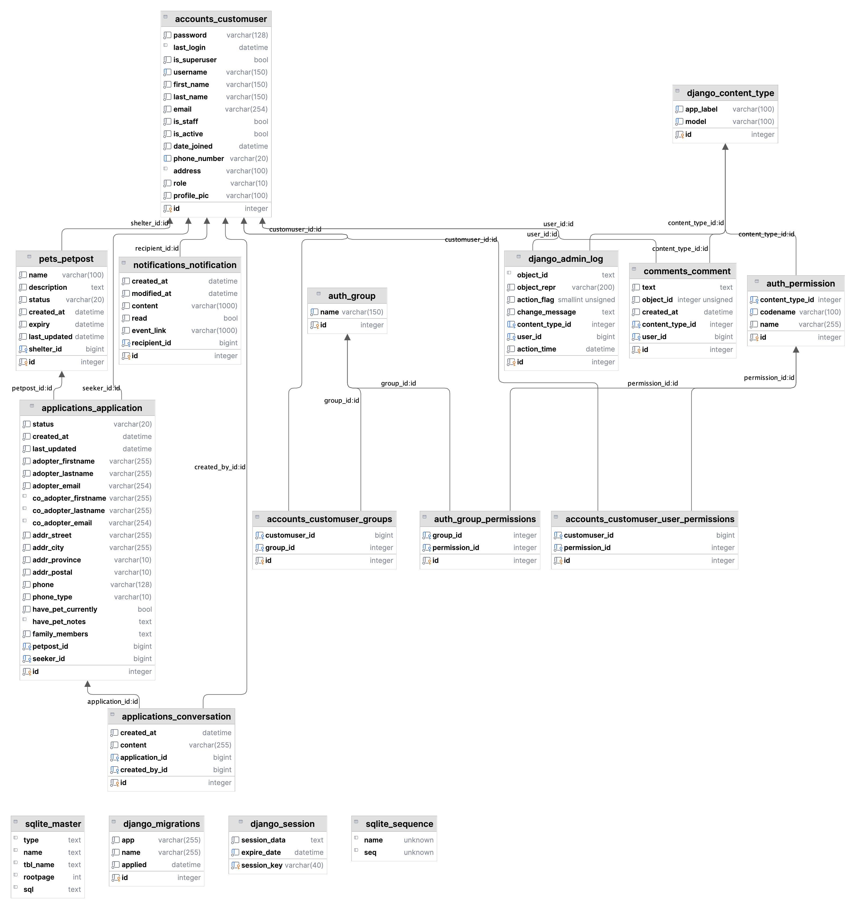

# Setup

```bash
chmod +x startup.sh
chmod +x run.sh

./startup.sh
./run.sh
```

# Model Design



# API Endpoints

## `Accounts Endpoints`

-   `/accounts/`
    -   `POST` (create user)
        -   ```json
            { "username": "seeker1", "password": "seeker1", "role": "seeker" }
            ```
        -   ```json
            {
            	"username": "shelter1",
            	"password": "shelter1",
            	"role": "shelter",
            	"address": "123 Main St, City, State, Zip"
            }
            ```
-   `/accounts/<id:user_id>/`

    -   `GET` (get user)
    -   `PUT` (update user)
        -   ```json
            { "first_name": "John", "last_name": "Doe" }
            ```
    -   `DELETE` (delete user)

-   `/accounts/auth/` (user login)
    -   `POST`
    -   ```json
        { "username": "seeker1", "password": "seeker1" }
        ```
    -   ```json
        { "username": "shelter1", "password": "shelter1" }
        ```

## `Pets Endpoints`
1. **List All Pet Posts**
   - **Endpoint**: `GET /pets/`
   - **Description**: Retrieves a list of all pet posts. Can include query parameters for filtering, sorting, and pagination.

2. **Create a New Pet Post**
   - **Endpoint**: `POST /pets/`
   - **Description**: Allows the creation of a new pet post. Requires data for the pet post in the request body.

3. **Retrieve a Specific Pet Post**
   - **Endpoint**: `GET /pets/{id}/`
   - **Description**: Retrieves a specific pet post by its ID.

4. **Update a Specific Pet Post**
   - **Endpoint**: `PUT /pets/{id}/`
   - **Description**: Fully updates a specific pet post. All pet post data must be provided in the request body.

5. **Partial Update a Specific Pet Post**
   - **Endpoint**: `PATCH /pets/{id}/`
   - **Description**: Partially updates a specific pet post. Only the provided fields in the request body will be updated.

6. **Delete a Specific Pet Post**
   - **Endpoint**: `DELETE /pets/{id}/`
   - **Description**: Deletes a specific pet post by its ID.

7. **List Pet Posts by a Specific Filter**
   - **Example Endpoint**: `GET /pets/?status=available`
   - **Description**: Lists pet posts filtered by a specific query. For example, filtering by `status`. This can be extended to other filters like `size`, `gender`, etc.

8. **List Pet Posts with Sorting**
   - **Example Endpoint**: `GET /pets/?sort=name`
   - **Description**: Lists pet posts with sorting based on specified fields such as `name` or `age`.


## `Comments Endpoints`

### Shelter User Comments

1. **List Comments for a Shelter User**
   - **Endpoint**: `GET /shelter-comments/<int:user_id>/`
   - **Description**: Retrieves a list of all comments for a specific shelter user. This endpoint is accessible to any authenticated user.
   - **Permissions**: Authenticated users can view comments.
   - **Example Response**:
     ```json
     [
       {
         "id": 1,
         "text": "Great shelter with caring staff!",
         "user": 2,
         "created_at": "2023-11-14T10:00:00.000Z"
       },
       {
         "id": 2,
         "text": "Highly recommend this place for pet adoption.",
         "user": 3,
         "created_at": "2023-11-13T15:30:00.000Z"
       }
     ]
     ```

2. **Create a Comment for a Shelter User**
   - **Endpoint**: `POST /shelter-comments/<int:user_id>/create/`
   - **Description**: Allows an authenticated user to create a comment on a specific shelter user's profile. The comment text should be included in the request body.
   - **Permissions**: Only authenticated users can create comments.
   - **Request Body Example**:
     ```json
     {
       "text": "This shelter has been wonderful in helping us find a new pet."
     }
     ```
   - **Success Response**:
     ```json
     {
       "id": 3,
       "text": "This shelter has been wonderful in helping us find a new pet.",
       "user": 4,
       "created_at": "2023-11-15T12:00:00.000Z"
     }
     ```


## `Applications Endpoints`

-   `/applications/seeker/` 
    - `GET` Retrieve list of application for the login pet seeker 
        - **Example Response**
            ```json
                {    
                  "count": 3,
                  "next": null,
                  "previous": null,
                  "results": [
                      {
                          "id": 5,
                          "seeker": 8,
                          "petpost": 4,
                          "status": "pending",
                          "last_updated": "2023-11-14T20:16:58.349515-05:00",
                          "created_at": "2023-11-10T16:49:45.324047-05:00"
                      },
                      {
                          "id": 6,
                          "seeker": 8,
                          "petpost": 2,
                          "status": "pending",
                          "last_updated": "2023-11-12T14:44:54.192166-05:00",
                          "created_at": "2023-11-12T00:41:27.110517-05:00"
                      },
                      {
                          "id": 7,
                          "seeker": 8,
                          "petpost": 5,
                          "status": "withdrawn",
                          "last_updated": "2023-11-12T14:44:13.948556-05:00",
                          "created_at": "2023-11-12T00:42:12.010093-05:00"
                      }
                  ]
              }
            ```
        - **Additional Notes**
-   `/applications/seeker/<application_id>`
-   `/applications/shelter/`
-   `/applications/shelter/<application_id>`
-   `/applications/pet/<pet_id>/`
-   `/<application_id>/conversations/`

## `Notifications Endpoints`

-   `/notifications`
-   `/notifications/<notification_id>`
